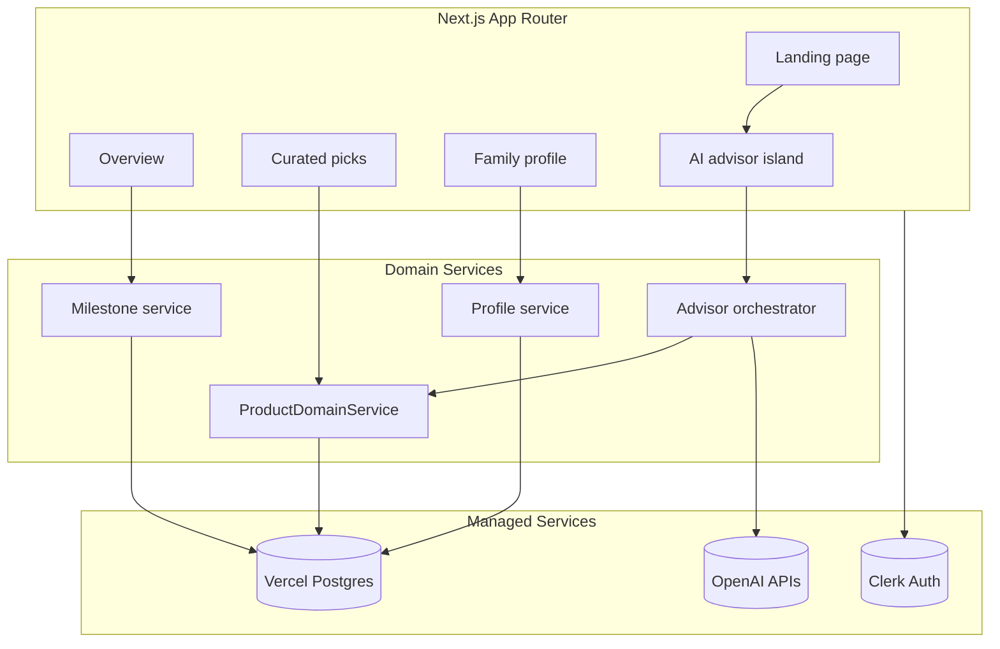

# Nestlings Planner

Nestlings Planner (codename: BabyBloom) is a milestone-aware assistant for new families. It keeps parents ahead of upcoming needs by tracking timelines, scoring catalog items against personalized preferences, and surfacing the next best action before each developmental window closes.

## Highlights
- **Milestone engine**: prenatal through toddlerhood, with adaptive timelines that shift when due dates change or birth is recorded.
- **Personalized scoring**: budget tier, eco priorities, and caregiver context tune the recommendations produced by the AI domain services.
- **Advisor chat**: an OpenAI-backed concierge that can explain suggestions, triage product lookups, and seed new list entries.
- **Ops-ready schema**: migrations and seeds keep Vercel Postgres aligned across environments, including baby name/location fields.

## Architecture at a Glance


### Data Flow
1. **Intake** – users authenticate with Clerk, complete onboarding, and persist profile preferences into `user_profiles`.
2. **Scheduling** – the milestone service computes upcoming windows from due/birth dates via `milestones` table ranges.
3. **Recommendations** – product queries add scoring metadata (eco, premium, milestone tags) and feed both the dashboard and the advisor agent.
4. **Advisor** – chat requests fan out to the domain services, enrich prompts with profile context, and call OpenAI for natural-language rationale.

## Why This Stack
| Concern | Choice | Why it matters |
| --- | --- | --- |
| UI & routing | **Next.js 15 / React 19** | App Router gives us streaming server components for static surfaces (e.g., home, how-it-works) while leaving room for rich client islands (dashboards, chat). We lean on React 19 transitions/suspense for smooth loading states. *Trade-off:* tight coupling to Vercel/Next release cadence; alternative: Remix or SvelteKit if you prefer filesystem-agnostic routing. |
| Language | **TypeScript** | End-to-end types cover migrations, API handlers, and UI contracts so schema changes surface immediately. *Trade-off:* TS adds build overhead; alternative: stay in modern JS with JSDoc or SWC type-checking. |
| Styling | **Tailwind CSS v4** | Utility classes + design tokens keep the bundle small and make it easy to ship responsive layouts that hold up on mobile and desktop out of the box. Tailwind v4’s PostCSS pipeline also speeds up rebuilds. *Trade-off:* class-heavy markup; alternative: CSS Modules or vanilla-extract if your team prefers component-scoped styles. |
| AuthN/AuthZ | **Clerk** | Provides hosted sessions, OAuth, and user management out of the box so we avoid hand-rolling JWT flows. *Trade-off:* vendor lock-in + per-seat cost; alternatives: Auth0, Supabase Auth, or NextAuth if you want full self-hosting. |
| Database | **Vercel Postgres** | Managed Postgres with array + JSONB support fits milestone/product data well and integrates with the Vercel runtime. *Trade-off:* limited extensions and connection pooling constraints; alternatives: Neon, PlanetScale (MySQL), or Supabase (Postgres + auth/storage). |
| AI layer | **OpenAI** | GPT-5 endpoints cover free-form advisor chat, structured extraction, and catalog reasoning with a single provider. *Trade-off:* usage cost and rate limits; alternatives: Anthropic Claude for long context, or self-hosted open models if you need full control. |
| Observability | **Vercel Analytics** | Lightweight Web Vitals out of the box while we bootstrap; we can layer in alternative telemetry later. *Trade-off:* high-level metrics only; alternatives: LogRocket, Highlight, or a full Datadog setup once deeper tracing is required. |

## Repository Tour
| Path | Role |
| --- | --- |
| `src/app` | App Router routes and layouts. Landing/home are server rendered; dashboard/curated/profile use client islands. |
| `src/components` | Shared UI, including the advisor chat widget (dynamically imported to avoid bundle bloat). |
| `src/lib` | Domain helpers: product, milestone, profile services, caching, and OpenAI orchestration. |
| `src/app/api` | Route handlers backed by Vercel Postgres queries. POST handlers enforce Zod schemas from `src/schemas`. |
| `scripts/` | Utilities to seed and test the Postgres instance. These run locally or via curl during setup. |
| `docs/` (coming soon) | Architectural decision records and additional diagrams. |

## Getting Started
1. Install dependencies: `pnpm install`
2. Copy environment template: `cp .env.example .env.local`
3. Fill in required secrets:
   - `NEXT_PUBLIC_CLERK_PUBLISHABLE_KEY`, `CLERK_SECRET_KEY`
   - `POSTGRES_URL`
   - `OPENAI_API_KEY` (and optional `OPENAI_PROJECT`)
   - `ADMIN_CLERK_IDS` (comma-separated Clerk user IDs with admin access)
   - Optional hardening knobs: `SCRAPE_ALLOWED_HOSTS`, `SCRAPE_TIMEOUT_MS`
4. Start the dev server: `pnpm dev`
5. In another shell prepare the database (requires access to your Postgres instance):
   ```bash
   pnpm dlx tsx scripts/setup-database.ts
   ```
6. Optionally load sample catalog data: `curl -X POST http://localhost:3000/api/products/seed`
7. Visit `http://localhost:3000` (main app) and `http://localhost:3000/how-it-works` for the guided tour.

### Useful Commands
```bash
pnpm lint   # ESLint + TypeScript checks
pnpm build  # Production build (Playwright types required if tests enabled)
pnpm dev    # Next dev server
ANALYZE=true pnpm build  # Optional bundle report (requires @next/bundle-analyzer)
```

## Operational Notes
- Whenever the schema changes, rerun `pnpm dlx tsx scripts/setup-database.ts` so Vercel Postgres picks up new columns and seeded reference data.
- AI endpoints call OpenAI; throttle or stub when running automated tests.
- The advisor chat and dashboard import Clerk components dynamically so unauthenticated experiences still load quickly.

## Contributing
- Follow Conventional Commits and keep PRs review-friendly.
- Run `pnpm lint` before pushing; CI checks the same.
- Document schema or env changes in the PR so deployers know to re-run migrations or rotate keys.
- Use feature flags or environment guards when introducing experimental agents or external APIs.
